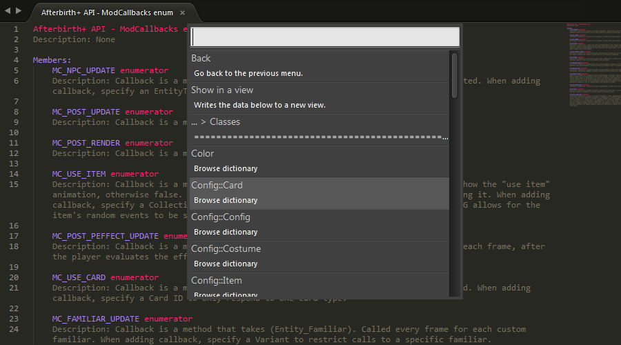

**The Subliming of Isaac**
==

An Atom package to improve your Binding of Isaac modding experience.

# **Contents**
- [Description](#description)
- [License](#license)

## **Description**
Atom-boilua is a package for the text editor [Atom](https://atom.io/) enabling autocompleting for the Lua modding API introduced in the Binding of Isaac: Rebirth expantion Afterbirth+.

The core documentation scraping functionality is based on Kapiainen's Sublime plug-in [The Subliming of Isaac](https://github.com/Kapiainen/The-Subliming-Of-Isaac).

## **Configuration**
This package requires the Atom-lua-autocomplete package to work properly, it uses its handy .luarc config file to interface cleanly with the autocomplete-plus suggestion provider.

## **License**
See [**LICENSE.md**](LICENSE.md) for more information.
